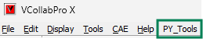
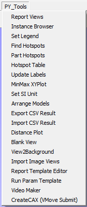

Py Tools
==========

VCollab provides **PY Tools**, a custom tools menu which comes with the installer. It can be accessed from the main menu.

Py Tools contains a set of utility functions which are associated with a set of python scripts. The description of association between each function name and corresponding Python script is to be defined in a specific format in a file **<VCOLLAB_DIR>/VCollabProX/VCollabStdPyTools.csv**.

.. code-block::

    #VCollab_Python_INTERFACE,
    GUI Mode=0,
    PY_Tools,
    Report Views,%VCOLLAB_DIR%\VCollabProX\PYTools\PyTool_Scripts\ReportViews.py
    Instance Browser,%VCOLLAB_DIR%\VCollabProX\PYTools\PyTool_Scripts\Instance_Browser.py
    Set Legend,%VCOLLAB_DIR%\VCollabProX\PYTools\PyTool_Scripts\set_legend_Json.py
    Find Hotspots,%VCOLLAB_DIR%\VCollabProX\PYTools\PyTool_Scripts\FindHotspots.py
    Part Hotspots,%VCOLLAB_DIR%\VCollabProX\PYTools\PyTool_Scripts\PartHotspots.py
    Hotspot Table,%VCOLLAB_DIR%\VCollabProX\PYTools\PyTool_Scripts\HotspotTable_MultiVPT.py
    Update Labels,%VCOLLAB_DIR%\VCollabProX\PYTools\PyTool_Scripts\Update_Labels.py
    MinMax XYPlot,%VCOLLAB_DIR%\VCollabProX\PYTools\PyTool_Scripts\MinMaxXYPlot.py
    Set SI Unit,%VCOLLAB_DIR%\VCollabProX\PYTools\PyTool_Scripts\setUNITS_SI.py
    Arrange Models,%VCOLLAB_DIR%\VCollabProX\PYTools\PyTool_Scripts\ArrangeModels.py
    Export CSV Result,%VCOLLAB_DIR%\VCollabProX\PYTools\PyTool_Scripts\ExportResults2CSV.py
    Import CSV Result,%VCOLLAB_DIR%\VCollabProX\PYTools\PyTool_Scripts\GenAllCSVImport.py
    Distance Plot,%VCOLLAB_DIR%\VCollabProX\PYTools\PyTool_Scripts\TrackDistPlot.py
    Blank View,%VCOLLAB_DIR%\VCollabProX\PYTools\PyTool_Scripts\Blankview.py
    View2Background,%VCOLLAB_DIR%\VCollabProX\PYTools\PyTool_Scripts\View2Background.py
    Import Image Views,%VCOLLAB_DIR%\VCollabProX\PYTools\PyTool_Scripts\ImportImageViews.py
    Report Template Editor,%VCOLLAB_DIR%\VCollabProX\PYTools\CMD_Editor\Run_VCTemplateEditor.py
    Run Param Template,%VCOLLAB_DIR%\VCollabProX\PYTools\CMD_Editor\Run_VCTemplateParameterEditor.py
    Video Maker,%VCOLLAB_DIR%\VCollabProX\PYTools\VideoMaker\Video_Make.py
    CreateCAX (VMove Submit),%VCOLLAB_DIR%\VCollabProX\PYTools\VMoveSubmit_ParamsEditor\VMSubmit_ParamsGUI.py

The following set of functions are provided in this release.

