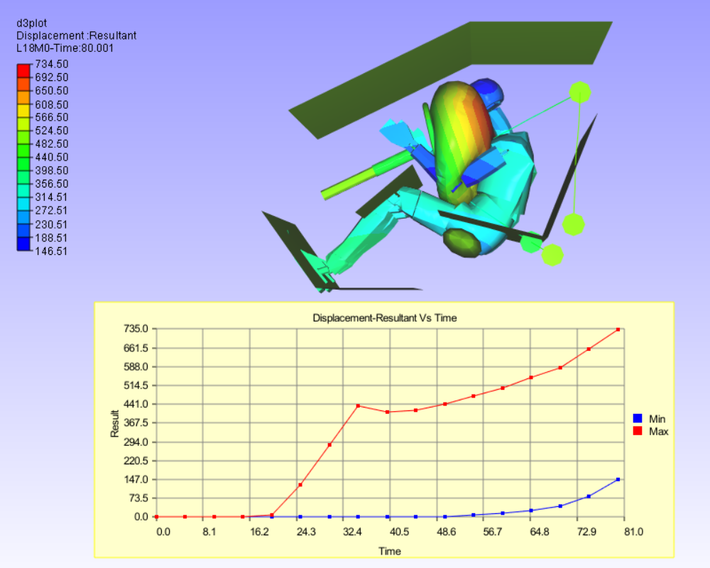
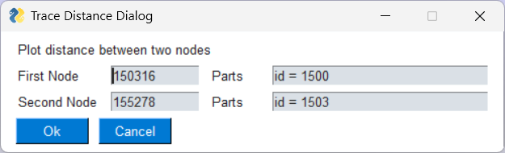

*********
Py Tools
*********

Report Views
**************

This function (script) will create a set of ViewPoints based on analysis type.

For loadcase analysis (Linear/Transient), the *HotSpot Views Options* dialog will ask user to select results and specify the number of hotspots. Maximum instance hotspot views will be created for each selected result.

For Modal Analysis, the *Modal Report Options* dialog will ask user inputs to create modal animation ViewPoints. User can select animation parameters and add a summary ViewPoint with frequency table. The *Create Hotspot ViewPoints* chcekbox will open the *HotSpot Views Options* dialog and user can create additional hotspot views.

Instance Browser
*****************

This script reads all the instances for the active derived result type and creates a table as shown in the image below.

Instances can be sorted by maximum or minimum value. User can select any row in table to display that instance. The *Hide Selected* button hides the selected row. *Show All* button can be used to show all rows including the hidden ones. *Delete All Hidden* deletes hidden rows and corresponding instances from the Cax. Table max/min values can be plotted in a graph by selecting the graph options.

Set Legend
**********

This script helps to easily modify the legend for the current plot. In the tab *Legend Settings* legend properties like Max-Min values, PreMax-PreMin values, Transperancy, Precision, etc. can be changed.

In the tab *Save/Load Options*, user can save current legend settings into a .json file. By default the location is same as Profile Path. User can enter a name in the *Name* field and click on *Save* to save current legend settings in the json file. Multiple such settings can be saved. All such saved settings are listed in the *Saved Legends List*. On selecting an item from the Saved Legends List, user can click *Load and Apply* to apply settings to the current display(current Model). The *Delete* button can be used to deltete an item from the Saved Legends List.

If the same legend settings are to be applied to different ViewPoints, user can go to the *VP Options* tab, select a ViewPath from the dropdown and select multiple ViewPoints. On clicking *Apply to VP(s)*, the current legend settings will be applied to the selected ViewPoints. If result for the selected item does not match the result in selected ViewPoint, an error message will inform the user about the mismatch.

*Set Result Range Params* are model specific parameters. Eg: Premin and Premax value for legend. User can select or unselect depending on the the model to which legend settings are applied. *Same Result Type* checkbox applies the legend settings only to same result type. Eg: If the saved result type of saved legend settings is Displacement then the Legend settings are applied only to displacement type results.

Find Hotspots
*************

This script helps to automatically create hotspot notes according to user inputs. It takes user inputs for the currently displayed result and instance as shown below.

In this dialog box user can specify:

    - Top/Bottom hotspot option (if Top Hotspot check box is check then Top option else Bottom option) and number of hotspots
    - Zone Radius
    - Legend Max, Min values to highlight specific range of values
    - Option to filter parts and associated limit
    - Precision settings for legend

On *Ok*, hotspots are displayed based on user selected probe settings. If *Filter Parts* option is selected then the parts with result value outside the filter limits are hidden (filter limits Top or Bottom is set based on the hotspot option).

Part Hotspots
*************

This script creates probes at minimum and/or maximum location for each individual parts that are currently displayed. The settings for finding hotspots in the *Hotspot Settings* like number of top and bottom hotspots, Zone Radius, etc. are followed. These are then applied to each visible part to create probes.

Hotspot Table
*************

This script creates a 2D table with Node ID, Part name, Position Coordinates(X,Y,Z) and result value for the probed labels. User can also specify the location for the table.

Max Rows and Columns limits the number of rows/columns displayed on each ViewPoint. In case the table dimensions exceed the precribed limits, new ViewPoint is created with the name prefix as provided in the *Save Table on ViewPoint* field.

If user wants to create tables for multiple ViewPoints, check the *Selected ViewPoint Labels* and choose ViewPoints from the *ViewPoints* tab.

.. note::  Use similar probe types (Derived or All result). It does not work for multi-model comparison tables.

Update Labels
*************

This function updates all labels with latest label settings. User can also update all viewpoints label.

Min-Max XY Plot
***************

This script creates MinMax XY Plot for currently displayed result.

Set SI Unit 
************

This function sets Units (SI) for all common result types (Results Option Dialog). These are for display purpose only.

.. image:: media/set_SI_units.png

Arrange Models
***************

This function arranges all merged models in evenly spaced rows. 

On *Ok*, the 2 models are arranged in one row.

If the Cax does not have multiple models, all visible parts(max. 25) are displayed in a grid.

Export CSV Result
*****************

This function exports current result instance into a csv file. User can select either from parts or nodesets. The *Nodesets* tab is greyed out if no nodesets are defined. User can choose multiple results and instances. The results are saved in the CSV file. The *Dump Option* writes the CSV with the header *#VCOLLAB_RESULTS_DUMP*.

.. image:: media/export_CSV_results_02.png
    :scale: 75 %

Import CSV Result
*****************

This function imports results from a csv file. It imports ASCII files, typically associated with fatigue results(.dma, .fer, .csv). On loading a file, the *Results At* (*Nodal* or *Elemental*) and *Select Results* list are updated with fields from that file. User can choose individual results or *All*. The *Instance name* specifies which instance the results will be imported into.

For importing VCollab CSV, use the provided functionality (File>Import...>Result Files csv).

Distance Plot
*************

This function helps to find or trace the distance between any two nodes among all time steps. Clicking this item, pops up an input dialog and prompts for any two node IDs. Input dialog takes first two node ids from probe tables if they are available. Otherwise user has to enter the node IDs manually in the input dialog box.

On clicking OK, an XYPlot with a single curve which represents the distance between given nodes is created.

Blank View
***********

This function clears the viewer screen in a single click. i.e. it hides all the objects in the ViewPoint. Set Plain background dialog asks user if plain white background is to be set.

View2Background 
***************

This function takes snap-shop of graphics area and sets that image as 2D background.

Import Image Views 
*******************

This function asks for an image folder and adds background image viewpoints for each image in the folder. This function can be used to import all the slides from a PowerPoint (PPTx) as 2D viewpoints. User can export PowerPoint slides as images (png/jpeg) into a folder, or create images from native post processor or CAD tools and then select this function.
Following dialog appears. On selecting a folder, the dialog box updates to show all images found in the folder.

New ViewPoints are created with selected images set as background.

Checking the *ImageLabel* sets the images as image lables instead of background images. The *Plain BG* option sets background to plain white.

Report Template Editor
***********************

To simplify report automation task, a list of generic commands are developed using VCollabPro python API. A list of such commands (*Report Template*) can be defined in a text file and a script can create viewpoints based on these commands. VCollab *Report Template Editor* is a GUI based tool to define, edit and run such commands or templates.

.. image:: media/Report_Template_Editor.png
    :scale: 75 %

Run Param Template 
********************

In order to run parameterized report templates, this tool loads only parameters from report template files. User can interactively update their values and run the template with updated values.

Video Maker 
***********

Animations can help to communicate complex geometric feature (Shape / Assembly / Joint / Connections), specific deformations or relative motion between parts and critical hotspot locations in a model. In general, a video should capture part movements, rotation of models or camera, sectional views and CAE animations. High quality animations are created by capturing many frames (images) and then stitching them together. It is a tedious time-consuming task to create these frames manually. To simplify this, a set of commands to capture images from different types of motions or animations is developed using VCollabPro Python API. A set of such commands can be used as a simple text-based template (Video Command Template) for creating videos. *Video Template Editor* is a GUI based tool to define, modify and run such video command templates.

CreateCAX (VMove Submit)
************************

**VMoveCAESubmit** is a VCollab tool to create Cax file from a native CAE files based on the parameters specified in a text file. The **GUI to Create Cax using VMoveCAESubmit** tool is developed to simplify Cax file creation using VMoveCAESubmit. Using this tool user can select or specify list of commands or parameters for Files, Results, Parts and Steps sections and create VMoveCAESubmit parameter file. This Command parameter file can be run to create and load CAX file in VCollabPro. The **GUI to Create Merged Cax** tool helps merge already created Cax files into single Cax.

.. Note:: This *PY Tools* is for common utility functions (may be for company level customization).  For user level customization, user can create same kind of csv file with user defined menu item names and corresponding scripts. Then copy the created csv and script files to the '%APPDATA%VCollab'. VCollab looks for any csv file with the proper header and creates the menu in the next application session.

