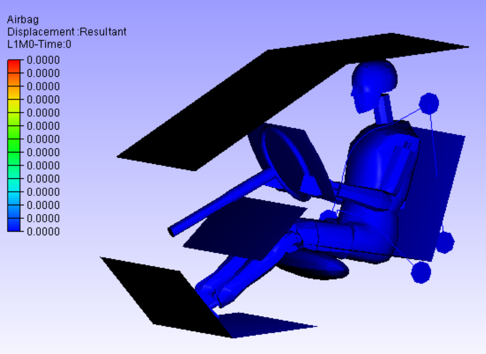
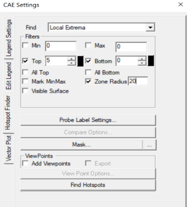

**************************
List of Commands
**************************

General Commands
=================

SAVE
*****

This command saves the 3D Report into various formats as listed.

.. code-block::

   SAVE, <HTML/WCAX/CAX/PDF>, <Output File Name>

- [1] Option

    - HTML
    - WCAX
    - CAX
    - PDF

- [2] Output file name (optional): By default, it will take same name as native file name

.. admonition:: Examples

    - Saves the CAX report with the same name as native file name.

        ::

            SAVE,CAX

    - Saves the HTML file with the same name as CAX file name.

        ::

            SAVE,HTML

CUR_FOLDER
***********

This command sets default Folder Path for files.

.. code-block::

    CUR_FOLDER,<CAX/PY/TEMP> or <Path>

- [1] Option

    - CAX: Cax file path is set as current folder
    - PY: Script file path
    - TEMP: VCollab Temp path or or log file path
    - <Path>: Enter full path

LOADCAX
********

This command opens the CAX file from the specified.

.. code-block::

    LOADCAX, <CAXFilePath>

- [1] Cax file path: of the file to be loaded

MERGECAX
*********

This command merges the CAx file into the current used CAx file.

.. code-block::

    MERGECAX, <Merge_CAXFilePath>

- [1] Cax file path: of the file to be merged

SET_VAR
********

Define list of variables.

.. code-block::

    SET_VAR,<variable_name>=<variable Value>

.. admonition:: Examples

    - Defines a variable *A* which is assigned a VCollab Instance *L3M1*.

        ::

            SET_VAR,A=L3M1

    - Defines a variable *VMStress_Limit* which is assigned a value of *390*.

        ::

            SET_VAR,VMStress_Limit=390

PARAMETER
***********

Define parameter of selected type with name and optional default value.Used for executing parameterised templates interactively. See :doc:`here <../Parameter_Editor_GUI>`.

.. code-block::

    PARAMETER,TYPE,Name or Key,<Default Value>

- [1] TYPE: If none of the options below are chosen, TEXT is the default.

    - TEXT
    - PARTS
    - MODEL
    - RESULT
    - INSTANCE
    - NODESETS
    - FOLDER
    - FILE
    - FILE_CAX
    - FILE_IMG
    - ASM: Assembly
    - CAMERA_VIEW
    - CAMERA_XYAXIS
    - VPINDEX: ViewPoint Index
    - VPNAME: ViewPoint Name
    - PART: Single
    - MODELS: Multiple
    - RESULTS: Multiple
    - INSTANCES: Multiple
    - NODESET: Single
    - ASMS: Assembly Multiple

- [2] Key or Parameter Name

- [3] Default value

.. admonition:: Examples

    - Defines a variable *PARTS2SHOW* which is assigned default value *\*part1\**.

        ::

            PARAMETER,PARTS,PARTS2SHOW,*part1*

SHOWCMDS
*********

Popup Display commands (for debugging).

.. code-block::

    SHOWCMDS, <Y/N>

- [1] bShowCmds: Set Y to show popups

SET_MODEL
**********

This sets model as current.

.. code-block::

    SET_MODEL, <model Name> 

- [1] Model name

AXIS_POS
*********

This sets the postion of axis on the screen based on X and Y position.

.. code-block::

    AXIS_POS, <X position>, <Y position> 

- [1] X position: increases from left to right on the screen
- [2] Y position: increases from top to bottom on the screen
- <X position> and <Y position> can be floating values

.. image:: media/Axis_Position.PNG

Set Camera Commands
===================

CAMERA_VIEW
************

This command sets the view direction (or camera Z direction vector <dx,dy,dz>) and Up-vector <ux,uy,uz>.

.. code-block::

    CAMERA_VIEW, dx, dy, dz, ux, uy, uz

- [1:3] Camera Z-Dir
- [4:6] Y-Dir Up Vector

- This command specifies camera orientation of a model in VCollab Pro GUI.

.. admonition:: Example

    ::

        CAMERA_VIEW,-0.63,0.36,-0.69,-0.57,0.4,0.72 

    .. image:: media/Camera_Settings.PNG

CAMERA_XYAXIS
**************

This command sets Camera axis X-dir and Y-Dir (Upvector).

.. code-block::

    CAMERA_XYAXIS, dx, dy, dz, ux, uy, uz

- [1:3] X-Dir
- [4:6] Y-Dir Up Vector

.. admonition:: Example

    ::

        CAMERA_XYAXIS,1,0,0,0,1,0

FIT_VIEW
*********

This command zooms the model view in VCollab Pro GUI.

.. code-block::

    FIT_VIEW, <zoom factor>

- [1] zoom factor (optional): Varies from -0.5 to +0.5, default is 1.0

.. admonition:: Example

    - It fits the model view in VCollab Pro GUI.

        ::

            FIT_VIEW

    - It fits the model view in VCollab Pro GUI with a zoom factor of *-0.3*.

        ::

            FIT_VIEW,-0.3

ORTHO_VIEW
***********

This command sets Ortho/Perspective Projection.

.. code-block::

    ORTHO_VIEW, <Y/N>

- [1] bOrtho: Set Y for Ortho, set N for Perspective

.. |img_pers| image:: media/Perspective.PNG
    :width: 300

+-------------+-------------------------+
| Ortho View  |    Perspective View     |
+-------------+-------------------------+
| |img_ortho| |      |img_pers|         |
+-------------+-------------------------+

ViewPoint Commands
==================

VIEWPATH
*********

This generates a ViewPath with user deifned name.

.. code-block::

    VIEWPATH, <ViewPath Name>

- [1] ViewPath name

.. image:: media/Viewpath.PNG

.. admonition:: Example

    This will create a viewpath by name *Sample*.

        ::

            VIEWPATH,Sample

.. note::
    New ViewPath is generated only when ViewPoint is created.

IMAGE_VP
*********

This creates the background and/or other images to be imported into VCollab.

.. code-block::

    IMAGE_VP, <VPName>, <image file name>, <Title String>, <Title Position(Sx,Sy)>

- [1] VPName: ViewPoint name (optional). If VPName=N, then image is set as background and ViewPoint is not created
- [2] Image File Name: user should provide image file name
- [3] Title String: ViewPoint title name (optional)
- [4,5] Title Position(Sx,Sy) : ViewPoint title X and Y position (optional)

.. admonition:: Example

    - Background is created using *Sample.png* file.

        ::

            IMAGE_VP,N,Sample.png 

    - ViewPoint named *Stress* is created with background image as *Sample.png*. Title *VM Stress* is also created in ViewPoint at the desired location.

        ::

            IMAGE_VP,Stress,Sample.png,VM Stress,0.2,0.1 

ADD_VP
*******

This creates a ViewPoint with user defined VPName.

.. code-block::

    ADD_VP, <vpname>, [<Title>, <title position xy>]

- [1] ViewPoint name
- [2:4] Title, title position xy (optional): It creates title in the VP and places at desired position

.. admonition:: Example

    - It adds a ViewPoint by the name VMStress.

        ::

            ADD_VP,VM_Stress 

    - It adds a ViewPoint by the name VMStress. Title *Stress* is added to the ViewPoint at desired position.

        ::

            ADD_VP,VM_Stress,Stress,0.2,0.1

ADD_VP_ANIM
************

This creates a ViewPoint with animation.

.. code-block::

    ADD_VP_ANIM, <vpname>, [<Title>, <title position xy>]

- [1] ViewPoint name
- [2:4] <Title>, <title position xy> (optional): It creates title in the ViewPoint and places it at desired position

.. admonition:: Example

    - It adds a ViewPoint with animation by the name VMStress.

        ::

            ADD_VP_ANIM,VM_Stress 

    - It adds a ViewPoint with animation by the name VMStress. Title *Stress* to the ViewPoint at desired position.

        ::

            ADD_VP_ANIM,VM_Stress,Stress,0.2,0.1

Set Display Commands
====================

DEL_ENTITY
***********

This command specifies entity types to be deleted.

.. code-block::

    DEL_ENTITY, PROBE, LABEL, TABLE, 2DLABEL, 3DLABEL, 2DTABLE, XY, SYMBOL, SECTION

.. note::
    This command is used in the beginning of every ViewPoint to clear the data from previous ViewPoint.

SET_DISPLAY
***********

This sets the display mode settings in the VCollab Pro GUI.

.. code-block::

    SET_DISPLAY, COLOR=Y, LEGEND=Y, DEFORM=Y, UDMESH=1, DMODE=1, AXIS=Y, SECTION=N, BG=1

- [1] Color: Sets CAE color plot, Y to apply color plot (optional)
- [2] Legend: Show Legend, Y to show the legend (optional)
- [3] Deform: Show deformation, Y to show the deformation (optional)
- [4] UDMesh: sets visibility for undeformed mesh, valid range is 0 to 3 (optional)

    - 0: Wireframe
    - 1: Transparent
    - 2: Feature Edges
    - 3: Transparent Edge

- [5] DMode: Sets display mode of the scene, valid range is 0 to 5 (optional)

    - 0: Shaded
    - 1: Shaded Mesh
    - 2: Wireframe
    - 3: Hiddenline Removal
    - 4: Point
    - 5: Transparent

- [6] Axis: Show Axis(Y/N), Y to show the axis (optional)
- [7] Section: Show section(Y/N), Y to show the section (optional)
- [8] BG: Background, valid range 0 to 2 (optional)

    - 0: Plain
    - 1: Gradient
    - 2: Texture, use command IMAGE_VP to set BG image

.. admonition:: Example

    - Sets the display mode settings according to the mentioned parameters.

        ::

            SET_DISPLAY,COLOR=Y,LEGEND=Y,DEFORM=N,SECTION=N,AXIS=Y

SHOW_LABEL
***********

This sets the probe label settings.

.. code-block::

    SHOW_LABEL, ID=Y/N, ROW=Y/N, COL=Y/N, RANK=Y/N, PART=Y/N, HEADER=Y/N, ABR=Y/N, PROBE=0, DISP=Y/N, ARRANGE=0-5

- [1] ID: Show node/element id (Y/N), Y to show id (optional)
- [2] ROW: Show row header (Y/N), Y to show row header (optional)
- [2] COL: Show column header (Y/N), Y to show column header (optional)
- [3] RANK: Show Rank (0/1/-1), 0 to hide Rank, 1 to show Rank and -1 to show Rank in ascending order (optional)
- [4] PART: Show Part name (Y/N), Y to show Part name (optional)
- [5] HEADER: Show Header Legend(Y/N), Y to show Header Legend (optional)
- [6] ABR: Display Abbreviations legend, Y to show Abbreviation Legend (optional)
- [7] PROBE: Sets current probe type, valid range is 1 to 5 (optional)

    - 1: CurrentResult-Derived
    - 2: CurrentResult-Full
    - 3: All Results-Table
    - 4: All Instances-Table
    - 5: All Instances-XY Plot

- [8] DISP: Show labels (Y/N), Y to show labels
- [9] ARRANGE: Sets label arrangement mode, valid range is 0 to 5 (optional)

    - 0: Actual.
    - 1: Top-Bottom.
    - 2: Compact
    - 3: Circular
    - 4: Silhouette
    - 5: Rectangular

.. admonition:: Example

    - Sets the probe label settings according to the mentioned parameters.

        ::

            SHOW_LABEL,ID=N,RANK=Y,PROBE=1

SET_FONT
*********

This sets the font for the entity type as listed.

.. code-block::

    SET_FONT, <Type>, <Size>, <Name>, <iR,iG,iB> , <ibR,ibG,ibB>, <iborder>

- [1] Type: Entity type

    - NOTE
    - PROBE_VALUE
    - PROBE_TEXT
    - OTHERS

- [2] Size: font size 
- [3] Name: font name
- [4:6] iR, iG, iB: font color RGB (0-255)
- [7:9] ibR,ibG,ibB: font background color (0-255)
- [10] iborder: Border on/off (0=Off else ON)

.. image:: media/Add_Notes.PNG

.. admonition:: Example

    - This will set the note settings according to the parameters with no border.

        ::

            SET_FONT,NOTE,18,Arial Bold,92,92,92,255,255,240,0

    - This will set the note settings with default label background with border.

        ::

            SET_Font,NOTE,26,Arial Bold,36,62,141

.. note::
    Values of <iR, iG, iB> and <ibR, ibG, ibB> are available in Add Notes dialog.
    User can click on the color and decide on the values accordingly.

SET_MODEL_COLOR
****************

This sets random colors to each part in the model (No arguments).

.. code-block::

    SET_MODEL_COLOR

- No arguments

Legend Commands
=================

SET_LEGEND
***********

This sets legend settings.

.. code-block::

    SET_LEGEND,<UserMax> ,<UserMin> ,<MAXLimit> ,<MINLimit> ,<Precision>, <Discrete(Y/N)>, <Reverse(Y/N)>, NColor

- [1,2] UserMax, UserMin: Sets Custom Legend Range, set NA to skip limit setting
- [3,4] MAXLimit, MINLimit: Legend limits, set NA to skip limit setting
- [5] Precision: Sets number of digits required in precision
- [4] Discrete: Set Y to display discrete legend
- [5] Reverse: Set Y to display reverse legend
- [6] NColor: Set number of colors in legend (optional)
- [7] All Instances: Set legend for all instances (optional)

.. image:: media/CAE_Settings.PNG

.. admonition:: Example

    - This will set the legend settings accordingly.

        ::

            SET_LEGEND,NA,NA,NA,NA,3,Y,N

LEGEND_HEXCOLORS
*****************

This sets the legend colors according to the hexcolors.

.. code-block::

    LEGEND_HEXCOLORS, <list of hex colors>

.. admonition:: Example

    ::

        LEGEND_HEXCOLORS,FF0000,FFDD00,00FF00,00DDFF,0000FF

SET_LEGEND_DYNRANGE
********************

This sets the values of legend as provided.

.. code-block::

    SET_LEGEND_DYNRANGE, <list of legend values>

- [1:] List of legend values: in descending order

.. admonition:: Example

    ::

        SET_LEGEND_DYNRANGE,20,10,5,2,0

LEGEND_POS
***********

This sets the legend position in the GUI screen.

.. code-block::

    LEGEND_POS, X_position, Y_position, bRelative (Y/N), iOrientation (0-3/N)

- [1] X_pos: Increases from left to right
- [2] Y_pos: Increases from top to bottom
- [3] bRelative: Y/N, Set Y to set relative to current legend position
- [4] iOrientation (0-3/N): Sets orientation (optional)

    - 0: Left
    - 1: Right
    - 2: Top
    - 3: Bottom
    - N: No change

.. image:: media/Axis_Position.PNG

.. admonition:: Example

    ::

        LEGEND_POS,0.01,0.25

LEGENDFONT_SIZE
****************

This sets the legend font size.

.. code-block::

    LEGENDFONT_SIZE, <iSize>, <fontName>

- [1] iSize
- [2] fontName

SET_PALETTE_MODE
*****************

This defines the result palette mode when there are merged models.

.. code-block::

    SET_PALETTE_MODE, <0/1/2/3>

- [1] Palette Mode:

    - 0: Active Model
    - 1: Multi Model
    - 2: Combined Model
    - 3: Multi_Common Model

Part Commands
===============

PART_OPTIONS
*************

This command sets the Display Mode and also sets the contour plot mode or material color mode.

.. code-block::

    PART_OPTIONS, DMODE=(0-5), COLOR=(Y/N), <PartsList>

- [1] DMODE=0-5: Display modes

    - 0: Shaded
    - 1: Shaded Mesh
    - 2: WireFrame
    - 3: Hidden Line Removal
    - 4: Points
    - 5: Transparent

- [2] COLOR=Y/N: Set Y for contor plot mode, N for material color mode
- [3:] Part name list

.. admonition:: Example

    - This will show the all the parts with *\*Bracket\** and *\*Lever\** keywords and will switch on the shaded mode for them.

        ::

            PART_OPTIONS,DMODE=1, *Bracket*, *Lever*

    - This will show the all the parts with *\*Bracket\** and *\*Lever\** keywords and will switch on contour plot mode for them.

        ::

            PART_OPTIONS,COLOR=Y,*Bracket*,*Lever*

PARTS_SHOW
***********

This shows the required Parts in the GUI.

.. code-block::

    PARTS_SHOW, <ALL/NONE/INVERT/ONLY/ADD>, <Part names list>

- [1] Option

    - ALL: Show all parts
    - NONE: Hide all parts
    - INVERT: Invert part show
    - ONLY: Show Only these parts
    - ADD: Show these parts

- [2:] Part names list

.. admonition:: Example

    - This will show the only the parts with *\*Bracket\** and *\*Lever\** keywords.

        ::

            PARTS_SHOW,ONLY,*Bracket*,*Lever*

PARTS_HIDE
***********

This hides the required Parts in the GUI.

.. code-block::

    PARTS_HIDE, <ALL/INVERT/ONLY>, <Part name list>

- [1] Option:

    - ALL: Hide all parts
    - INVERT: Invert part hide
    - ONLY: Hide Only these parts

- [2:] Part name list

.. admonition:: Example

    - This will hide the only the parts with *\*Bracket\** and *\*Lever\** keywords.

        ::

            PARTS_HIDE,ONLY,*Bracket*,*Lever*

ASM_SHOW
*********

This sets assembly show/no show.

.. code-block::

    ASM_SHOW, <Y/N>, <Assembly Names>

- [1] bAsmShow: Y/N, Set Y to show
- [2:] Assembly names

FILTER_PARTS
*************

This command filters the parts based on results in the GUI screen.

.. code-block::

    FILTER_PARTS, fMin, fMax, <bFitView(Y/N)>

- [1] fMin: Min result limit for filtering parts or NA can be provided
- [2] fMax: Max result limit for filtering parts or NA can be provided
- Both fMin and fMax cannot be NA, atleast one limit should be provided
- [3] bFitView (Y/N): For a fit view of filtered parts (optional)

Result Commands
=================

SEL_RESULT
***********

This selects the result to be displayed in GUI.

.. code-block::

    SEL_RESULT, <Result Name>, <Instance>, <Derived Type> 

- [1] Result Name: Selects the name of the result to be displayed
- [2] Instance: Selects the instance of the result to be displayed
- [3] Derived Type: Selects the derived type of the result to be displayed

    - By default, Derived type is NA

.. image:: media/CAE_Result.png

.. admonition:: Example

    - This will select the *Max Principal Stress* result for *L3M1* instance.

        ::

            SEL_RESULT,*Stress*max*prin*,L3M1,NA

SEL_INSTANCE
*************

This selects the instance for current result.

.. code-block::

    SEL_INSTANCE, <InstFlag>

- [1] Instance Flag:

    - 0: Last Instance
    - 1: Max Instance
    - 2: Min Instance
    - 3: First Instance 
    - Else Current Instance

CREATE_RESULT
**************

This creates the new result from the existing result.

.. code-block::

    CREATE_RESULT ,<New Result Name>, <Result A>, <Result B>, <Equation with A and B>

- [1] New Result Name
- [2] Result A name: for the expression
- [3] Result B name: for the expression
- [4] Arithmetic expression or formula with variables A and B

.. admonition:: Example

    - This creates a max result from result A and B.

        ::

            CREATE_RESULT,Name,A,B,IF((abs(A)>abs(B)),A,B)

CREATE_ENVELOP
***************

This creates Max/Min envelope result.

.. code-block::

    CREATE_ENVELOP, <sResult>, <sDerived>, <bIsMax(Y/N)>

- [1] sResult: Required result for creating envelope
- [2] sDerived: Derived type for the result or NA can be used for default
- [3] bIsMax: Y/N, Set Y for Max envelope(default) and N for Min envelope (optional)

CREATE_RESULT_CYL
******************

This creates a cylindrical co-ordinate result for the selected result.

.. code-block::

    CREATE_RESULT_CYL, RefResult, NewResult, <Origin(XYZ)>, <XDir(xYZ)>, <YDir(xyz)>, U/All

- [1]: VCollab Result name
- [2]: New result name
- [3:5]: Origin of the new coordinate system
- [6:8]: X axis vector
- [9:11]: Y axis vector
- [12]: Component name can be empty or any one of the following

    - For Vector Result: "U","V","W"
    - For Tensor Result: "S11","S22","S33","S12","S23","S13"

.. admonition:: Example

    - This creates a new cylindrical result *Disp Radial* with origin at <*53.66 73.05 42.747*>.

        ::

            Displacement,Disp Radial, 53.66, 73.05, 42.747, 1, 0, 0, 0, 1, 0, U

NEW_INSTANCE
*************

This command creates instance using expression.

.. code-block::

    NEW_INSTANCE, Result, InstA, InstB, Expression, sNewInst

- [1]: VCollab Result
- [2]: Instance A name for the expression
- [3]: Instance B name for the expression
- [4]: Arithmetic expression or formula with variables A and B
- [5]: New Instance Name

.. admonition:: Example

    - This creates a new instance by the name *MaxDamage* from the *Damage* instance *L1M1* and *L2M1*.

        ::

            NEW_INSTANCE,Damage,L1M1,L2M1,Max(A,B),MaxDamage

NodeSet Mask Commands
======================

RES_MASK
**********

This creates a NodeSet from the selected result for masking.

.. code-block::

    RES_MASK, <mask name>, <result name>, <n Adj>, <min> ,<max> 

- [1]: User Defined NodeSet name
- [2]: VCollab Result name
- [3]: Number of adjacent layer to mask (optional)
- [4]: Minimum range value to get the nodes within the result (optional)
- [5]: Maximum range value to get the nodes within the result (optional)

.. admonition:: Example

    - This will create a NodeSet *CPMask* based on *Contact Pressure* masking limits.

        ::

            RES_MASK,CPMask,Contact Pressure,1,0.01,1000

PART_MASK
***********

This creates NodeSet from the selected parts for masking.

.. code-block::

    PART_MASK, <maskname>, <partname>, <Proximity dist>, <n Adj>

- [1]: User defined Node set name
- [2]: Part name to be masked
- [3]: Proximity of the nodes to be added to the NodeSet
- [4]: Number of adjacent layer to be masked

.. admonition:: Example

    - This will create a NodeSet *BracketMask* based on the nodes in *\*B\*EXCLUDE* parts. *1* layer of adjacent nodes is also added to the masking NodeSet *BracketMask*.

        ::

            PART_MASK,BracketMask,*B*EXCLUDE,NA,1

NODE_MASK
***********

This creates NodeSet from the selected nodes.

.. code-block::

    NODE_MASK, <maskname>, <Radius>, <nodelist>

- [1] maskname: User defined Mask Name
- [2] Radius: The nodes within this range are added to the NodeSet, it should be floating value
- [3] nodelist: list of nodes ids for masking

.. admonition:: Example

    - This will create a NodeSet *NodeMask* based on the nodeslist *11234*, *3456*.

        ::

            NODE_MASK,NodeMask,15.0,11234,3456

SET_MASK_MODE
**************

This sets the mode of the masking node sets.

.. code-block::

    SET_MASK_MODE ,<MODE>, <mask name list>

- [1]: Mode can be 0/1/2

    - 0: N/A
    - 1: In
    - 2: Out

- [2:] Mask name list: can be the NodeSet names available for masking

SET_MASK
***********

This sets the mode of the masking node sets to IN.

.. code-block::

    SET_MASK_IN ,<mask name list>

- [1:] Mask name list: can be the NodeSet names available for masking

SET_MASK_IN
**************

This sets the mode of the masking node sets to IN.

.. code-block::

    SET_MASK ,<mask name list>

- [1:] Mask name list: can be the NodeSet names available for masking

Hotspot Commands
==================

PROBE_RES
***********

This creates a list of results to be displayed in probe label.

.. code-block::

    PROBE_RES, <ProbeResultList> 

- [1:] List of results to be added to the probe labels

.. admonition:: Example

    - This will create a list of *VonMises* and *Max Principal Stress* when probing.

        ::

            PROBE_RES,*Stress*von*mis*,*Stress*Max*prin*

HS_LIMITS
***********

This command sets the Hotspot Dialog Parameters.

.. code-block::

    HS_LIMITS, <filter range: min, max>, <nTop>, <nBottom>, <ZoneRadius>

- [1]: Sets minimum range value
- [2]: Sets maximum range value
- [3]: Number of top hotspots
- [4]: Number of bottom hotspots
- [5]: Defines the zone radius for hotspots

.. admonition:: Example

    - This will set the hotspot dialogue box parameters.

        ::

            HS_LIMITS,NA,NA,5,0,20.0

HOTSPOT_VIEW
*************

This creates a ViewPoint with the given hotspots settings.

.. code-block::

    HOTSPOT_VIEW, <sVPName>, <Hotspot Params>

- [1] sVPName: ViewPoint name

HS Parameters:

- [2]: Sets minimum range value
- [3]: Sets maximum range value
- [4]: Number of top hotspots
- [5]: Number of bottom hotspots
- [6]: Zone radius for the hotspot

.. admonition:: Example

    - This will create new ViewPoint named *Hotspots VP* with top *5* hotspots and zone radius of *20*.

        ::

            HOTSPOT_VIEW,Hotspots VP,NA,NA,5,0,20.0

COMP_HOTSPOTS
**************

This computes the hotspot with NodeSet masking.

.. code-block::

    COMP_HOTSPOTS, sVPName, Masklist

- [1]: ViewPoint name, Set 'N' for not adding ViewPoint
- [2]: NodeSets name for masking
- If no parameters are given, it will find the hotspot in the GUI and ViewPoint needs to saved using *ADD_VP* command

LOADCASE_HSVIEW
****************

This creates hotspot view for each instance.

.. code-block::

    LOADCASE_HSVIEW,<VPathName> ,<iFirstInstance>, <iLastInstance>

- [1]: ViewPath name (optional)
- [2]: Starting Instance (optional)
- [3]: Ending Instance (optional)
- If no parameters are provided then, hotspot view for all instances will be generated for the displayed result

.. admonition:: Example

    - This will create new hotspot ViewPoints in ViewPath for instances *5* to *9*.

        ::

            LOADCASE_HSVIEW,sVPathName,5,9

HEADER_POS
***********

This sets the location for header legend (set before *PROBE_RES* call).

.. code-block::

    HEADER_POS, <Screen_Xpos>, <Screen_Ypos>

- [1]: Screen Xpos (optional)
- [2]: Screen Ypos (optional)
- [3]: Ending Instance (optional)
- If no parameters are provided then, the Screen_Xpos and Screen_Ypos are set to 0.05 and 0.7

SET_COMPARE_RES
****************

This sets the Hotspots compare settings.

.. code-block::

    SET_COMPARE_RES, <ON=Y/N>, <BY=0-2>, <MODE=0-2>, <WITH=0-2>, <RADIUS=5.0>, <SHOWALL=Y>, <B2A=Y/N>

- [1] ON=Y/N: Y to set hotspots compare option ON
- [2] BY=0-2: Sets Comparison of Results mode, valid Range 0-2

    - 0: Same Result Name
    - 1: Selected Results Order
    - 2: Result's Display Name

- [3] MODE=0-2: Sets comparison mode, valid range 0 to 2

    - 0: For Same Part
    - 1: For Current Visible Parts
    - 2: For All parts

- [4] WITH=0-2: Sets comparison, valid range 0 to 2

    - 0: For Same Part
    - 1: For Current Visible Parts
    - 2: For All parts

- [5] RADIUS: Float value, sets a radius to compare hotspots within a sphere
- [6] SHOWALL=Y/N: If set to Y, sets additional label lines to compared node/element of other models
- [7] B2A=Y/N: If set to Y, finds hotspots in all models and compares across all models. If set to N, find Hotspots only in the current model and those Hotspots are used to compare across all models.

.. admonition:: Example

    - This will set the result compare settings accordingly.

        ::

            SET_COMPARE_RES,ON=Y,BY=0,MODE=1,WITH=0,RADIUS=5.0,SHOWALL=Y,B2A=N

HS_TABLE2D
**************

This command creates a hotspots summary table.

.. code-block::

    HS_TABLE2D,<ScreenX>, <ScreenY>, <Header strings>

- [1] ScreenX: X position of table in screen
- [2] ScreenY: Y position of table in screen
- [3:] Header text for table fields

.. admonition:: Example

    ::

        HS_TABLE2D,0.1,0.6,NodeID,VonMises,StressMaxP

Auto View Commands
====================

ALL_RESULT_VPS
***************

This command computes hotspots and creates a ViewPoint. If Modal result is available it creates one Modal ViewPoint.

.. code-block::

    ALL_RESULT_VPS, <nhotspots>

- [1]: Number of Hotspots
- Results with name <Thickness Bottom Material Force Volume Constraint> are not considered

.. admonition:: Example

    ::

        ALL_RESULT_VPS,5

MODAL_VPS
************

If Modal data is available this command creates Modal views else it creates hotspot views for each result.

.. code-block::

    MODAL_VPS, <no of modes>, 

- [1]: Number of mode case
- [2]: Creates a mode case table if set to Y

.. admonition:: Example

    ::

        MODAL_VPS,5,Y

COMPARE_GEOM_VPS
*****************

This command finds the difference between the two model's geometry (Merged models) and creates the ViewPoints.

.. code-block::

    COMPARE_GEOM_VPS, <compare mode>, <max search distance>

- [1]: Sets compare mode, valid range 0-2

    - 0: Same Parts
    - 1: Visible Parts
    - 2: All Parts

- [2]: Two model points are compared within this value, geometry deviation more than this value is ignored

.. admonition:: Example

    ::

        COMPARE_GEOM_VPS,1,20

ENVELOP_VIEW
*************

This command creates a CAE envelope result for transient or multi-instances data and creates hotspot view.

.. code-block::

    ENVELOP_VIEW, <sResultStr>, <hotspot parameters>

- [1]: Result name for the envelop result

HS Parameters list (optional):

- [2]: Sets minimum range value
- [3]: Sets maximum range value
- [4]: Number of top hotspots
- [5]: Number of bottom hotspots
- [6]: Zone radius for the hotspot

- hslimits: None, If the user does not want to change the Hotspot settings
- DelInst: Instance name that is to be deleted(optional)

.. admonition:: Example

    ::

        ENVELOP_VIEW,*von*Mises*,NA,NA,5,20.0

EXPLODE_VIEW
*************

This command sets parts in an exploded view.

.. code-block::

    EXPLODE_VIEW, <Y/N>, <Percentage(0-100)>

- [1]: Y/N, Set Y for Explode and Reset, Set N for just Explode
- [2]: Percentage value of current explode, it should be >0 and <=100

XY Plot Commands
==================

MINMAX_PLOT
*************

This command creates Min-Max XYPlot for current result.

.. code-block::

    MINMAX_PLOT, <Plot Name>, <iMinmax>

- [1] Min max Plot name
- [2] iMinmax: Index of curve to be created

    - 0: Max curve(default)
    - 1: Min curve
    - 2: Both min and max curves

HS_XYPLOT
***********

This command computes hotspots and creates Transient XY plot with curves for selected number of hotspots.

.. code-block::

    HS_XYPLOT, <Plot Name>, <MaxHS>

- [1] XY Plot name
- [2] MaxHS: Max number of hotspots/curves

SETXYPLOT_WIN
**************

This command sets the XY plot background and windows size.

.. code-block::

    SETXYPLOT_WIN, <bgColor(rgb)>, <winsize(xmin,ymin,xmax,ymax)>

- [1:3]: XY Plot background colors RGB(0 to 1)
- [4:6]: XY Plot window size(xmin,ymin,xmax,ymax)

IMPORT_XYCSV
*************

This command imports the result from CSV File in XYPlot.

.. code-block::

    IMPORT_XYCSV, <csvfile>

- [1]: CSV file path

Other Commands
==================

ADD_2DNOTE
**************

This command adds a 2d note in the ViewPoint.

.. code-block::

    ADD_2DNOTE, <Note String>, <2D position(x, y)>

- [1]: Note text
- [2]: X and Y normalized position in GUI(0 to 1)

.. admonition:: Example

    ::

        ADD_2DNOTE,Title Page,0.4,0.3

SET_ANIM
**********

This command sets animation type and settings.

.. code-block::

    SET_ANIM, <Type>, <nFrames>, <bStaticFringe(Y/N)>, <Scale factor>, <Speed>

- [1] Type: Animation type, valid values 0/1/3

    - 0: Linear
    - 1: Transient
    - 3: Harmonic

- [2] nFrames: Sets number of frames (instances)
- [3] bStaticFringe: Set Y for Static fringe (same legend for all animation frames)
- [4] Scale factor: Sets scale factor based on bounding box. Deformation percentage is with respect to geometry size
- [5] Speed: Set delay value to slow animation in milliseconds, valid range 0 to 100 and 100 sets max speed

.. admonition:: Example

    ::

        SET_ANIM,1,20,Y,3,20

ARRANGE_MODEL
**************

This command arranges the models in a row.

.. code-block::

    ARRANGE_MODEL, <Nrow>

- [1] Nrow: Number of rows to arrange models. If Nrow<0, it resets the model.

RUN_SCRIPT
************

This command runs a script file with given arguments.

.. code-block::

    RUN_SCRIPT, <ScriptFile>, <bReUse(Y/N)>, <FunctionName>, <Arguments..>

- [1]: Script file path
- [2]: Set Y to reuse module(optional)
- [3]: Function name in script to be executed
- [4:]: Arguments for the function

.. admonition:: Example

    ::

        RUN_SCRIPT,E:\Userlocation\sample.py

PYRUN
*******

This command runs VCollab API function call.

.. code-block::

    PYRUN, <One line Python Script>

- [1] <One line Python Script>: VCollabAPI function with all its required arguments as strings

.. admonition:: Example

    ::

        PYRUN,.xSetPartColor("spot","PSHELL PID_114",255,0,0,1)

PYSGRUN
********

This command Runs VCollab API function call and displays result in a popup for debugging.

.. code-block::

    PYSGRUN, <One line Python Script>

- [1] <One line Python Script>: VCollabAPI function with all its required arguments as strings

.. admonition:: Example

    ::

        PYSGRUN,.pxGetCAECurrentResult("")

EXIT
*******

This command stops execution of command list. All further commands are not executed.

.. code-block::

    EXIT

- No arguments