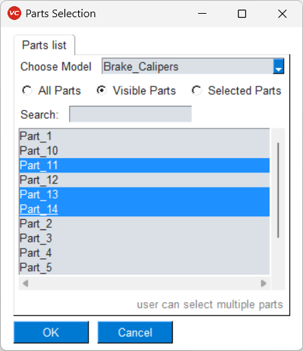
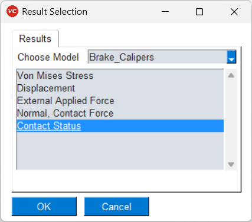
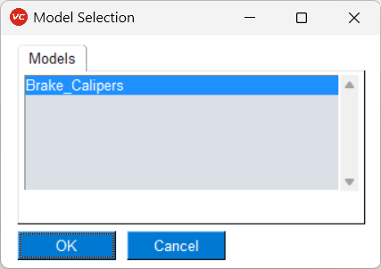
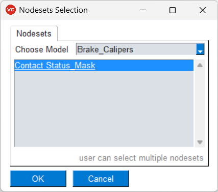
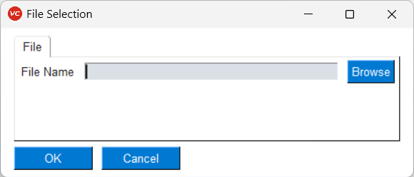
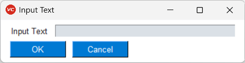

***************************
Parameter Editor GUI
***************************

An example of a parameterised Command Template is shown below. It has **SET_VAR** and **PARAMETER** commands that define variables and their values. 

In order to run a Command Template interactively without changing other text in it, user can select the submenu *Run Param Template* from *PY_Tools* main menu of VCollab Pro or ProX. User can load a command template by selecting it in the browser. On **Load** following dialog is shown. The **SET_VAR** and **PARAMETER** variables are visible and available for user to update.

.. |open| image:: media/icons8-opened-folder-96.png
    :width: 24
.. |save| image:: media/icons8-save-96.png
    :width: 24
.. |runcmd| image:: media/icons8-exercise-96.png
    :width: 24
.. |addL| image:: media/icons8-add-properties-96.png
    :width: 24
.. |reset| image:: media/icons8-available-updates-96.png
    :width: 24
.. |cmdlist| image:: media/icons8-property-96.png
    :width: 24
.. |help| image:: media/icons8-help-96.png
    :width: 24

.. |pick| image:: media/icons8-webpage-click-96.png
    :width: 24

The dialog has following buttons:

- |open| **Open**: Opens *Load Template File* dialog to select a report template file (*.txt* or *.cmd* or *.csv*). The already loaded command template will be discarded, along with any changes made to the value fields and new command template will be loaded. The main dialog will disappear for a moment before loading the new command template.

    .. image:: media/Parameter_Editor_Load.png
        :scale: 75 %

- |cmdlist| **View**: Opens the loaded command template. User can review the entire text of the command template. 

    .. image:: media/Parameter_Editor_View.png
        :scale: 75 %

    - It is **not** editable. Use the **Report Template Editor** if user wishes to alter the template itself.

- |runcmd| **Run**: Runs all commands in the command template with updated *SET_VAR* and *PARAMETER* values. The original text of the loaded command template is not altered.

- |save| **Save**: Saves all the updated *SET_VAR* and *PARAMETER* values. A *Save Commands* dialog will pop up for user to select new command template file.

- |reset| **Reset**: Resets all changed values to their original(or default) values.

- |help| **Help**: Shows this help document in a browser tab.
- |exit| **Exit**: Closes this dialog and exits.

**SET_VAR**: The Key is shown as non-editable text and the value is an editable input field. User can directly update the value. An icon |set_var_options| appears next the value field. On clicking it, a list of available options appears. User can choose which option is to be used to select from Cax interactively.

    .. image:: media/Parameter_Editor_SetVar_Options.png
        :scale: 75 %

**PARAMETER**: Parameter Key is shown as non-editable text and the value is an editable input field. User can directly update the value. An icon |pick| appears next to the value field. On clicking it, an appropriate dialog appears for user to choose from Cax interactively.

As can be seen in the example, *SET_VAR* has no type defined, hence user has to first select it for dialog to appear. The *PARAMETER* already has a defined type, hence an appropriate dialog appears. Examples shown below.

+-----------+------------+--------------+
| **Parts** | **Result** | **Instance** |
+===========+============+==============+
|  |parts|  |  |result|  |  |instance|  |
+-----------+------------+--------------+

+-----------+--------------+--------------+
| **Model** | **Assembly** | **Nodesets** |
+===========+==============+==============+
|  |model|  |  |assembly|  |  |nodesets|  |
+-----------+--------------+--------------+

+----------+------------+----------+
| **File** | **Folder** | **Text** |
+==========+============+==========+
|  |file|  |  |folder|  |  |text|  |
+----------+------------+----------+

.. |instance| image:: media/Pick_Instance.png
    :scale: 50 %

.. |assembly| image:: media/Pick_Assembly.png
    :scale: 50 %

.. |folder| image:: media/Pick_Folder.png
    :scale: 50 %

