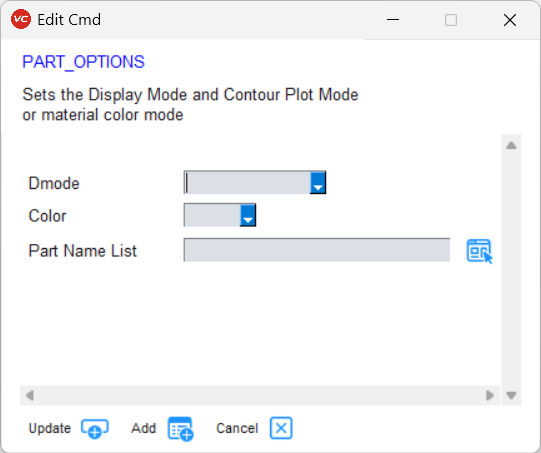

***************************
Report Template Editor GUI
***************************

To open the GUI, select the submenu *Report Template Editor* from *PY_Tools* main menu of VCollab Pro or ProX.

GUI
====

- **Commands List**: Current list of commands in the template. User can Add, Modify, Run or Save these commands.

- **Enter Command**: User can define a new command in this text field. This command can be added to the command list.

- **Arguments**: When user enters a valid command, a list of parameters that can be specified for the command will be displayed in this text box.

.. |open| image:: media/icons8-opened-folder-96.png
    :width: 24
.. |save| image:: media/icons8-save-96.png
    :width: 24

.. |editcmdy| image:: media/icons8-edit-property-green-96.png
    :width: 24
.. |delete| image:: media/icons8-trash-96.png
    :width: 24
.. |addcmd| image:: media/icons8-add-properties-96.png
    :width: 24
.. |editcmd| image:: media/icons8-add-row-96.png
    :width: 24

.. |help| image:: media/icons8-help-96.png
    :width: 24
.. |exit| image:: media/icons8-close-window-96.png
    :width: 24

The **Commands List** has following buttons:

- |open| **Open**: Opens a file selection dialog to select a report template file (*.txt* or *.cmd* or *.csv*). The commands from this file will be added to the *Commands List*.

    .. image:: media/Report_Template_Open.png
        :scale: 75 %

    - Use *Run Cmds* option in the popup dialog to create the report.

- |save| **Save**: Saves all commnds defined in the *Commands List* as a report template file. Additionally, user can save the file as template by checking the *Save As Template* checkbox. That way the template becomes available in the **Examples** dialog.

    .. image:: media/Report_Template_Save.png
        :scale: 75 %

- |loadF| **Examples**: User can add commands from the provided example command text files, or can load saved templates for editing further.

    .. image:: media/Examples_SavedTemplates.png
        :scale: 75 %

- |runcmd| **Run Commands**: Runs all commands in the *Commands List*.
- |applytovp| **Apply to VP**: Runs all commands for each selected ViewPoints and update ViewPoint. A dialog will popup to select ViewPoints.

    .. image:: media/Report_Template_ApplyToVPs.png
        :scale: 75 %

The Commands list itself can be viewed in *Text Mode* or *List Mode*. In the **Text Mode**:

- |editcmdn| |editcmdy| **Edit Cmd Text**: This is a toggle button. When green, user can directly edit the commands in the *Commands List* (*List Mode* is disabled when green).
- |delete| **Clear Cmd Text**: Clears all commands from the *Commands List*.

In the **List Mode** the same commands list is displayed but user cannot directly edit it.

- |editcmd| **Edit Cmd**: When a single line in the *Commands List* is selected and this button is clicked, dialog box for updating arguments corresponding to selected command pops up. User can then change the arguments interactively.
- |runcmd| **Run Selected**: Runs the selected lines from the *Commands List*.
- Both options **Edit Cmd** and **Run Selected** are available on selecting lines and right clicking.

The **Enter Command** section lets user to add command to the *Commands List*.

- |addcmd| **Add Cmd**: Click the button(icon) to add the specified command from *Enter Command* field to the *Commands List*.

    - If the **RUN** checkbox is checked, this command will also be executed.

- |reset| **Clear Cmd**: Clears the *Enter Command* text field.
- |cmdlist| **Select Cmd**: A list of all commands is shown in **Select Command Dialog** (see below). When a command is selected, it can be interactively edited.
- |editcmd| **Edit Cmd**: When user starts entering a command, options are displayed as a dropdown. User can choose a command and and the **Arguments** text field is updated with information on that command. On clicking the *Edit Cmd* button, a dialog box will open up with arguments required for that command. Then user can interactively update arguments (see examples of **Edit Cmd** dialogs below).
- |help| **Help**: Shows this help document in a browser tab.
- |exit| **Exit**: Closes this dialog and exits.

The **Select Command** Dialog

Examples of **Edit Cmd** dialogs

When user selects a command from the **Select Command Dialog**, or by clicking the **Edit Cmd** button either on the *List Mode* of the **Commands List** or **Enter Command**, this dialog will pop up. If user has entered any arguments, they will automatically reflect in the corresponding fields, otherwise default arguments will appear. User can update the arguments (which can be checkboxes, drop-down lists or text input fields).

- |editcmd| **Update**: Only updates the entered arguments in the command. Either from *Enter Command* field or in the *List Mode* of *Commands List*.
- |addcmd| **Add**: Adds the command to the end of *Commands List* directly.
- |exit| **Cancel**: Cancels updating/adding command.
- |pick| **Pick from GUI**: This button is placed next to certain fields such as when user needs to give argument as Parts, Result, Instance, Model, Nodesets or File. On clicking, dialogs for selecting the options available from the Cax will appear. Here are example dialogs.

+-----------+------------+--------------+
| **Parts** | **Result** | **Instance** |
+===========+============+==============+
|  |parts|  |  |result|  |  |instance|  |
+-----------+------------+--------------+

+-----------+--------------+--------------+
| **Model** | **Assembly** | **Nodesets** |
+===========+==============+==============+
|  |model|  |  |assembly|  |  |nodesets|  |
+-----------+--------------+--------------+

+----------+------------+----------+
| **File** | **Folder** | **Text** |
+==========+============+==========+
|  |file|  |  |folder|  |  |text|  |
+----------+------------+----------+

.. |parts| image:: media/Pick_Parts.png
    :scale: 50 %

.. |result| image:: media/Pick_Result.png
    :scale: 50 %

.. |model| image:: media/Pick_Model.png
    :scale: 50 %

.. |nodesets| image:: media/Pick_Nodesets.png
    :scale: 50 %

.. |file| image:: media/Pick_File.png
    :scale: 50 %

.. |text| image:: media/Pick_Text.png
    :scale: 50 %

Example
========
Here is a sample command template file::
    
    VIEWPATH,CAE Report                                 # Set Viewpath for the report
    IMAGE_VP,N,VC_ColorBG.png                           # Set image background for all viewpoints
    SET_FONT,NOTE,12,Arial Bold,92,92,92,255,255,240,0  # Set font for all 2D text labels
    PARTS_SHOW,ALL                                      # Display all parts
    CAMERA_VIEW, 1.0, 1.0, 1.0,0.0,0.0,1.0              # (direction dx,dy,dz , up vector ux,uy,uz)
    FIT_VIEW, 0.1                                       # Fit model and zoom out
    # Set display parameters for next viewpoint
    DEL_ENTITY,XY,LABEL,SYMBOL,PROBE                    # Delete all existing label and xyplotdisplays
    SET_DISPLAY,COLOR=Y,LEGEND=Y,DEFORM=Y,DMODE=0       # Set model display settings for next viewpoint
    # Create specific views
    MODAL_VPS,5,Y                                       # If Modal data create Modal views else create hotspot views for each result
    # Save Report
    CUR_FOLDER,CAX                                      # Set current folder to CAX file folder. Used for next Save commands
    SAVE, CAX                                           # Save CAX file
    #SAVE,HTML                                          # Save html file (commented out)
    EXIT                                                # Quit command processing

.. note:: Commands will be excecuted line by line. Any text after '#' is a comment.

