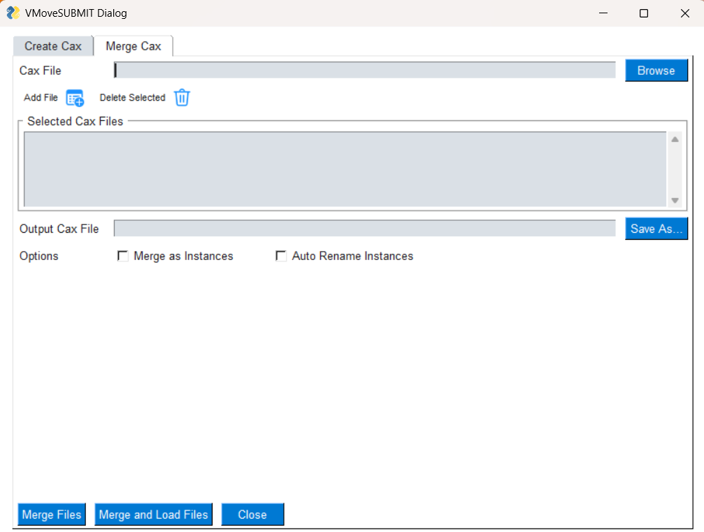

**************************
GUI to Create Merged Cax 
**************************

.. |addL| image:: media/icons8-add-properties-96.png
    :width: 24
.. |trash| image:: media/icons8-trash-96.png
    :width: 24
.. |help| image:: media/icons8-help-96.png
    :width: 24

**Merge Cax** is a tool to merge multiple Cax files.

- **Cax File**: Specify the Cax file to be added to the list for the merge operation.

- |addL| **Add File**: Adds the selected Cax file to the *Selected Cax Files* list.

- |trash| **Delete Selected**: Removes the selected file from the *Selected Cax Files* list.

- **Output Cax File**: Specify the name of the merged Cax file.

- **Options**: Specify the options for merged Cax file.

    - **Merge as Instances** : Merges results into different instances. For this, instance names should be different.
    - **Auto Rename Instances** : It renames instances with combinations of file name and instance name. Eg.If *file1* has *Result1* with name *L1M1* and *file2* has same *Result1* with same name *L1M1*, this option renames with instance names as *file1L1M1* and *file2L1M1*.

- **Merge Files**: Click this button to save the merged Cax file. It serves as a save-only option, storing the file in the path specified in the *Output Cax File* field.

- **Merge and Load Files**: Click this button to save the merged Cax file. Cax file will be saved in the path specified in Output Cax File field. Once the Cax merge process is completed it will load the merged Cax file.

- **Close**: Close VMoveCAESubmit GUI dialog and exit.
