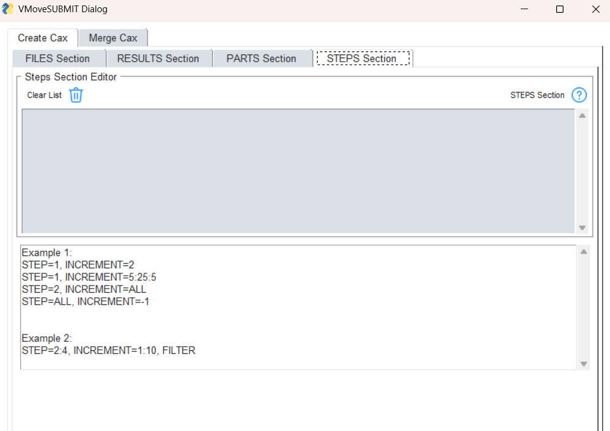

***************************************
GUI to Create Cax using VMoveCAESubmit
***************************************

.. |addL| image:: media/icons8-add-properties-96.png
    :width: 24
.. |editOFF| image:: media/icons8-edit-property-96.png
    :width: 24

.. |trash| image:: media/icons8-trash-96.png
    :width: 24

This GUI tool is developed to simplify Cax file creation using VMoveCAESubmit. Using this tool user can select or specify list of commands or parameters for Files, Results, Parts and Steps sections and create VMoveCAESubmit parameter file. This Command parameter file can be run to create and load Cax file in VCollabPro.

General help for VMoveCAESubmit command parameters is available in https://training.vcollab.com/Translators/VMoveCAE/Submit/usage.html

Files Section
==============

Used to specify VMoveCAE which files to use.

.. image:: media/file_section.png
    :scale: 75 %

- **Native File**: Specify the Native CAE file which need to be converted to Cax. 

- **Cax File**: This field specifies the path for the Cax file to be saved. This is auto filled once the Native file is selected (If the Native file folder has the write permission). User can modify this Cax file path as required.

- **Command File**: This is the path where VMoveSubmit Command File is saved. This field as well is auto-filled once the Native file is selected. User can edit this path and specify the location where Command File is to be saved. If this filed is empty or not valid, Command file is saved in <VCollab Tempfile Path>.

- **Additional Lines**: This field is used to specify additional files section input lines (based on the native files). For certain native files, It may be required to add additional files.

    - **Add Result files**: User can choose additional files.

For example, ds.dat command file can be specified along with native ANSYS rst file ::

    - ds.dat, TYPE=ANSYS_CMDS

For Fluent .cas file, it is required to append .dat file ::

    - blower.dat, TYPE=FLUENT_DAT

Additional results (such as fatigue) files can be added as additional lines ::

    - abc.dma, TYPE=FEMFAT_DMA, CONTENT=RESULTS
    - abc.csv, TYPE=VCOLLAB_CSV
    - abc.npz, TYPE=NUMPY_NPZ

- **Abaqus Input File**: This is an optional selection. This field is activated only if Abaqus .odb file is selected as Native file. As the name suggests user can select Abaqus .inp file to create **entity sets** (CONTENT=ENTITY_SETS) instead of odb.

- **History File**: This is an optional selection. This field is activated only if Abaqus .odb file is selected as Native file. Specify the path to save history data file in json format.

- **Options**: Specify the file specific load and translation options.

    - *ZERO_FRAMES* : Select this option to include Frame number Zero for each Step (LxM0)
    - *FAST_LOAD_ODB* : Select this option only if all the frames in the ODB file have same set of results.
    - *MID_NODES* : Select this option to translate mid nodes (if present)
    - *NO_AVERAGE_ACROSS_REGIONS*: Refer to VMoveCAESubmit manual for this option.

- **Command Template File**: This function allows to reuse an existing Command File as a template. When the user select the file, the Result, Part and Step sections are read from the file and respective sections in this dialog are updated. User can then modify these sections if required.

- |help| **Help** : Opens VMoveCAESubmit Files Section help. For the detailed description of the Files Section parameters please refer to the Files Section help.

Results Section
================

Used to specify required results to be translated and associated control parameters. Refer to the VMoveSubmit help for supported parameters.

- **Select From List**: User can select common results from available list of results along with **Position**, **Map Type** and **Section** parameters. Please refer to the Results Section help for the detailed description of each of the parameters.

    First select required results from the two list boxes and also select required result parameters. Then click **Add Selected Results** button. This will add selected results to the *Results Section Editor* filed. User can modify these results or optional parameters.

- **Custom Results**: Add any specific result (along with the parameters) in the edit filed and click **Add Result** button. This result line will be added to the *Results Section Editor*.

- **Results Section Editor**: All selected results are displayed in this multiline edit filed. User can modify any result line. Note: need to select **Edit List** icon to enable editing. Select **Clear List** icon to clear all selected results.

- |editOFF| |editON| **Edit List**: This is a toggle button. When green, user can directly edit the commands in the Result List.

- |trash| **Clear List**: Clears the Result list.

- |help| **Help**: Opens VMoveCAESubmit Results section help. For the detailed description of the Results Section parameters please refer to the Results Section help.

Parts Section
==============

Used to specify VMoveCAE how to group elements into parts, what parts to translate or what parts to filter.

- **Grouping**: From the drop down user can select Part grouping to be used.

- **Part Name**: User can specify the part names to be grouped. User can enter all the part names to be grouped separated by comma. Example::

    STD*,*TETRA_MESH*,*WarnElem*

- **Filter**: Filters the part from Cax output. If the checkbox is checked Filter is applied to all the parts specified in Part name.

- |addL| **Add Parts**: Adds the comma separated part names into list.

- |trash| **Delete Selected**: Deletes the part name selected from the Part List.

- |help| **Help**: Opens VMoveCAESubmit Parts Section help. For the detailed description of the Parts Section parameters please refer to the Parts Section help.

Steps Section
==============

Used to specify the steps/frames/load cases/modes that needs to be translated or filtered by VMoveCAE.

User can manually enter the values in the multiline edit filed. The example section shows common commands used to select required steps. For the detailed description of the Steps Section parameters please refer to the Steps Section help.

- |trash| **Clear List**: Clears step list.

- |help| **Help**: Opens VMoveCAESubmit Steps Section help. For the detailed description of the Steps Section parameters please refer to the Steps Section help.

Options
========

Once all parameters are specified in respective sections, user can save these parameters to the command file. It is also possible to run VMoveSubmit application to create Cax file and load it into VCollabPro.

- **Load Cax File**: Click this button to save these parameters to the command file and create Cax file using it. Once the Cax conversion is completed it will load the Cax file. Please Note that Cax conversion can take time if the Native file is very large.

- **Save Command File**: Click this button to save all the section parameters to the command file. User can use this file to run VMoveCAESubmit application in a batch mode. This option can be used if the native file is very large. To run *inputs.txt* command file:

    - Windows command prompt ::
    
        VMoveCAESubmit inputs.txt
    
    - Linux terminal ::
    
        vmovecae -submit inputs.txt

- **Close**: Close VMoveCAESubmit GUI dialog and exit.

- **Help**: Opens this VmoveCAESubmit GUI tool help documentation.

Example 
========

Here is a sample command parameters file (it can be downloaded :download:`here <media/vmcae_input_sample.txt>`)::

    #############################################################################
    #                                                                           #
    #                     VMoveCAESubmit Input file                             #
    #                                                                           #
    #############################################################################
    #                                                                           #
    # The translation inputs are categorized into different sections.           #
    #                                                                           #
    # Section lines start with "* "                                             #
    # Data lines start with "- ".                                               #
    #                                                                           #
    #############################################################################
    #                                                                           #
    # FILES Section                                                             #
    # -------------                                                             #
    #                                                                           #
    #   This section specifies all the files that needs to be read into         #
    #   VMoveCAE. This is a mandatory section.                                  #
    #                                                                           #
    #   Usage Example:                                                          #
    #   -------------                                                           #
    #                                                                           #
    #     * FILES, FOLDER="/home/vcollab/models"                                #
    #     - "viewer_tutorial.odb", TYPE=ODB                                     #
    #                                                                           #
    #    File names are specified in the data lines. File names can be          #
    #    enclosed in quotes if they contain spaces or any special characters.   #
    #                                                                           #
    #  Section Options:                                                         #
    #  ---------------                                                          #
    #                                                                           #
    #    FOLDER: Base folder. When a base folder is specified, all the relative #
    #            paths are considered to be relative to the base folder.        #
    #                                                                           #
    #  Data Options:                                                            #
    #  -------------                                                            #
    #                                                                           #
    #    TYPE: File type. Supported values are:                                 #
    #          - ABAQUS_ODB                                                     #
    #          - ABAQUS_INP                                                     #
    #          - FEMFAT_UFF                                                     #
    #          - NCODE                                                          #
    #          If not specified, VMoveCAE tries to auto-detect the file type.   #
    #    CONTENT: Tells VMoveCAE what to read from specific file. If not        #
    #             specified, VMoveCAE handles it automaticaly.                  #
    #             Supported values are:                                         #
    #             - MODEL                                                       #
    #             - ENTITY_SETS                                                 #
    #             - RESULTS                                                     #
    #                                                                           #
    #############################################################################

    * FILES, FOLDER="/home/vcollab/models"

    - viewer_tutorial.inp, TYPE=ABAQUS_INP, CONTENT=ENTITY_SETS
    - viewer_tutorial.odb, TYPE=ABAQUS_ODB, CONTENT="MODEL, RESULTS"
    - viewer_tutorial.cax, TYPE=VCOLLAB

    #############################################################################
    #                                                                           #
    # PARTS Section                                                             #
    # -------------                                                             #
    #                                                                           #
    #   This section tells VMoveCAE how to group elements into parts, what      #
    #   parts to translate and what parts to filter. This is an optional        #
    #   section. If not specified, VMoveCAE uses default part grouping          #
    #   element sets for Abaqus models) and exports all parts into the          #
    #   CAX file.                                                               #
    #                                                                           #
    #   Usage Example:                                                          #
    #   -------------                                                           #
    #                                                                           #
    #     * PARTS, GROUPING=element-set                                         #
    #     - STD*, FILTER                                                        #
    #     - HB*                                                                 #
    #                                                                           #
    #    Part names are specified in the data lines. Part names can be          #
    #    enclosed in quotes if they contain spaces or any special characters.   #
    #                                                                           #
    #  Section Options:                                                         #
    #  ---------------                                                          #
    #                                                                           #
    #    GROUPING: Part grouping to be used. Supported values:                  #
    #              - property-id                                                #
    #              - material-id                                                #
    #              - element-set                                                #
    #              - element-and-face-sets                                      #
    #                                                                           #
    #  Data Options:                                                            #
    #  -------------                                                            #
    #                                                                           #
    #    FILTER: Filters the part from Cax output.                              #
    #                                                                           #
    #############################################################################

    * PARTS, GROUPING=element-and-face-sets

    - STD*, FILTER
    - _Whole*, FILTER
    - *TETRA_MESH*, FILTER
    - "_ALL ELEMENTS", FILTER
    - *WarnElem*, FILTER

    #- Part*

    #############################################################################
    #                                                                           #
    # RESULTS Section                                                           #
    # ---------------                                                           #
    #                                                                           #
    #   This section tells VMoveCAE what results to translate and what results  #
    #   to filter. This is an optional section. If not specified, VMoveCAE      #
    #   exports all results into the CAX file.                                  #
    #                                                                           #
    #   Usage Example:                                                          #
    #   -------------                                                           #
    #                                                                           #
    #     * RESULTS                                                             #
    #     - Displacement, SOURCE=U                                              #
    #     - NT                                                                  #
    #     - Stress, SOURCE=S, THRESHOLD=75                                      #
    #     - Elemental Stress, SOURCE=S, POSITION=E                              #
    #                                                                           #
    #    Result names are specified in the data lines. Result names can be      #
    #    enclosed in quotes if they contain spaces or any special characters.   #
    #    Alternately, users can specify the source result name in the native    #
    #    CAE solver instead of using VCollab result name.                       #
    #                                                                           #
    #  Data Options:                                                            #
    #  -------------                                                            #
    #                                                                           #
    #    FILTER: Filters the result from Cax output.                            #
    #    SOURCE: Name of the variable as specified by CAE solver                #
    #    POSITION: Whether the Cax file should provide nodal (N) or             #
    #              elemental (E) values.                                        #
    #    DERIVED: Name of the derived component that needs to be extracted      #
    #    THRESHOLD: Percentage of averaging threshold to be used (similar to    #
    #               Abaqus viewer)                                              #
    #                                                                           #
    #############################################################################

    * RESULTS
    #- U
    #- S, DERIVED=VON_MISES, THRESHOLD=75
    #- S, DERIVED=MAX_PRINCIPAL, THRESHOLD=75
    #- S, DERIVED=MIN_PRINCIPAL
    #- S, DERIVED=XX, POSITION=E
    #- E
    #- *cont*pres*
    # - PEEQ

    #############################################################################
    #                                                                           #
    # STEPS Section                                                             #
    # -------------                                                             #
    #                                                                           #
    #   This section tells VMoveCAE what instances to translate and what        #
    #   instances to filter. This is an optional section. If not specified,     #
    #   VMoveCAE exports all instances into the CAX file.                       #
    #                                                                           #
    #   Usage Example:                                                          #
    #   -------------                                                           #
    #                                                                           #
    #     * STEPS                                                               #
    #     - STEP=1:100:10, INCREMENT=-1                                         #
    #                                                                           #
    #    Step numbers are specified in the data lines. A range can be be        #
    #    specified using ":" as a separator. "-1" can be used to refer to the   #
    #    last step. "ALL" refers to all the available steps.                    #
    #                                                                           #
    #  Data Options:                                                            #
    #  -------------                                                            #
    #                                                                           #
    #    STEP: Step numbers are specified in the data lines. A range can be be  #
    #          specified using ":" as a separator. "-1" can be used to refer to #
    #          the last step. "ALL" refers to all the available steps.          #
    #    INCREMENT: Increment number of the step to translate. A range can be   #
    #               be specified using ":" as a separator. "-1" can be used to  #
    #               refer to the last increment.                                #
    #    TIME: Time of the step/frame that needs to be translated.              #
    #    FREQUENCY: Frequency of the step/frame that needs to be translated.    #
    #                                                                           #
    #############################################################################

    #* STEPS
    #- STEP=2, INCREMENT=4:10
    
