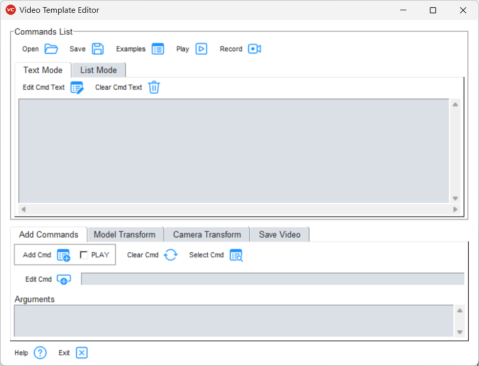

**************************
Video Template Editor GUI
**************************

To open the GUI, select the submenu *Video Maker* from *PY_Tools* main menu of VCollab Pro or ProX.

GUI
====

- **Commands List**: Current list of commands in the template. User can Add, Modify, Run or Save these commands. It has following buttons:

    - |open| **Open**: Opens a file selection dialog to select a report template file (*.txt* or *.cmd* or *.csv*). The commands from this file will be added to the *Commands List*.

        .. image:: media/Video_Template_Open.png
            :scale: 75 %

        - Use *Play Cmds* option in the popup dialog to create the report.

    - |save| **Save**: Saves all commnds defined in the *Commands List* as a report template file. Additionally, user can save the file as template by checking the *Save As Template* checkbox. That way the template becomes available in the **Examples** dialog.

        .. image:: media/Video_Template_Save.png
            :scale: 75 %

    - |loadF| **Examples**: User can add commands from the provided example command text files, or can load saved templates for editing further.

        .. image:: media/VideoExamples_SavedTemplates.png
            :scale: 75 %

    - |play| **Play Commands**: Executes all commands in the *Commands List*.
    - |help| **Help**: Shows this help document in a browser tab.
    - |exit| **Exit**: Closes this dialog and exits.

The Commands list itself can be viewed in *Text Mode* or *List Mode*.

- In the **Text Mode**:

    .. image:: media/Video_Text_Mode.png
        :scale: 75 %

    - |editcmdn| |editcmdy| **Edit Cmd Text**: This is a toggle button. When green, user can directly edit the commands in the *Commands List* (*List Mode* is disabled when green).
    - |delete| **Clear Cmd Text**: Clears all commands from the *Commands List*.

- In the **List Mode** the same commands list is displayed but user cannot directly edit it.

    .. image:: media/Video_List_Mode.png
        :scale: 75 %

    - |editcmd| **Edit Cmd**: When a single line in the *Commands List* is selected and this button is clicked, dialog box for updating arguments corresponding to selected command pops up. User can then change the arguments interactively.
    - |play| **Play Selected**: Runs the selected lines from the *Commands List*.
    - Both options **Edit Cmd** and **Play Selected** are available on selecting lines and right clicking.

- The **Add Command** section lets user to add command to the *Commands List*.

    .. image:: media/Video_Add_Commands.png
        :scale: 75 %

    - |addcmd| **Add Cmd**: Click the button(icon) to add the specified command from *Enter Command* field to the *Commands List*.

        - If the **PLAY** checkbox is checked, this command will also be executed.

    - |reset| **Clear Cmd**: Clears the *Enter Command* text field.
    - |cmdlist| **Select Cmd**: A list of all commands is shown in **Select Command Dialog** (see below). When a command is selected, it can be interactively edited.
    - |editcmd| **Edit Cmd**: When user starts entering a command, options are displayed as a dropdown. User can choose a command and and the **Arguments** text field is updated with information on that command. On clicking the *Edit Cmd* button, a dialog box will open up with arguments required for that command. Then user can interactively update arguments (see examples of **Edit Cmd** dialogs below).

- **Model Transform**: User can define a set of Model/Part transformation (rotate and move) commands using GUI.

    .. image:: media/Model_Transforms_Tab.png
        :scale: 75 %

    - Select few parts from screen and use **+/-** buttons to rotate or translate the selected parts. Each button click will add rotation/translation according to defined *Step*.
    - Selected parts will be displayed in the **Selected Parts** list box. By default *ALL* checkbox is checked, so all visible parts will rotate/translate. Otherwise the *Selected Parts* list will be populated by selected parts. Alternatively, user can click on the *Pick from GUI* button |pick| to select parts.
    - **Screen Axis** toggle can be used to define axis in Screen/Camera cordinate system. 
    - **Frames** will be used as number of frames.
    - |reset| **Reset** will reset the model to its original position 
    - |addcmd| **Add as Cmd** will create all the model movement commands and add them to the *Commands List*.

- **Camera Transform**: User can define a set of Camera transform commands (rotate and move) in this GUI.

    .. image:: media/Camera_Transforms_Tab.png
        :scale: 75 %

    - Use **+/-** buttons to rotate or translate the camera. Each button click will add camera rotation/translation according to defined *Step*.
    - **Screen Axis** toggle can be used to define axis in Screen/Camera cordinate system. 
    - **Frames** will be used as number of frames.
    - |reset| **Reset** will reset the camera to Standard View (Front).
    - |addcmd| **Add as Cmd** will create all the camera movement commands and add them to the *Commands List*.

- **Save Video**: User can Save a video file from this tab.

    .. image:: media/Save_Video_Tab.png
        :scale: 75 %

    - When the **Record** button is *ON* |recON|, and the **Play** button is clicked, the commands will be run. The recorded images will be saved in a temperory folder and the **Captured Frames** will be updated.
    - |reset| **Reset** will reset the captured images.
    - User can click **Save As...**, browse to the folder and set the video file name. Currently supported formats are: *MP4*, *GIF*, *AVI*, *FLV*, and *WMV*.
    - |save| **Save Video** will stitch all the captured images together and save them as the video file. If the *OPEN IN PLAYER* checkbox is *ON*, the saved video will start playing in the default video player.

- The **Select Command** Dialog

    .. image:: media/Video_Select_Command_Dialog.png
        :scale: 75 %

- Examples of **Edit Cmd** dialogs

    When user selects a command from the **Select Command Dialog**, or by clicking the **Edit Cmd** button either on the *List Mode* of the **Commands List** or **Enter Command**, this dialog will pop up. If user has entered any arguments, they will automatically reflect in the corresponding fields, otherwise default arguments will appear. User can update the arguments (which can be checkboxes, drop-down lists or text input fields).

    .. image:: media/VPANIM_PARAMS_Arguments_Dialog.png
        :scale: 50 %

    .. image:: media/VP2VP_ANIM_Arguments_Dialog.png
        :scale: 50 %

    .. image:: media/PA_MOVE_Arguments_Dialog.png
        :scale: 50 %

    - |editcmd| **Update**: Only updates the entered arguments in the command. Either from *Enter Command* field or in the *List Mode* of *Commands List*.
    - |addcmd| **Add**: Adds the command to the end of *Commands List* directly.
    - |exit| **Cancel**: Cancels updating/adding command.
    - |pick| **Pick from GUI**: This button is placed next to certain fields such as when user needs to give argument as Parts, Result, Instance, Model, Nodesets or File. On clicking, dialogs for selecting the options available from the Cax will appear. Here are example dialogs.

    +---------------+-----------+-----------+
    | **ViewPoint** | **Parts** | **Model** |
    +===============+===========+===========+
    |  |viewpoint|  |  |parts|  |  |model|  |
    +---------------+-----------+-----------+

    +----------+------------+----------+
    | **File** | **Folder** | **Text** |
    +==========+============+==========+
    |  |file|  |  |folder|  |  |text|  |
    +----------+------------+----------+

    .. |viewpoint| image:: media/Pick_VP.png
        :scale: 50 %

    .. |parts| image:: media/Pick_Parts.png
        :scale: 50 %

    .. |model| image:: media/Pick_Model.png
        :scale: 50 %

    .. |file| image:: media/Pick_File.png
        :scale: 50 %

    .. |folder| image:: media/Pick_Folder.png
        :scale: 50 %

    .. |text| image:: media/Pick_Text.png
        :scale: 50 %

Example
========
Here is a sample command template file::
    
    #-- VPANIM_PARAMS,nFrame_VP2VP,nImgsPerView=1,iSectionAnimFrames,iExplodeAnimFrames
    VPANIM_PARAMS,25,2,25,25
    #-- VPANIM_CAEPARAMS,bCAEAnim(Y/N),nCylesPerView,nFramesPerCyle,nImgsPerCAEFrame
    VPANIM_CAEPARAMS,Y,4,24,1
    #-- Select ViewPoint 1
    APPLY_VP,1
    VP2VP_ANIM,1,3
    MOVE_CAMERA,300,100,0,30,Y
    ROTATE_CAMERA,1,0,0,90,30,Y
    SAVE_VIDEO,Test123.mp4,0
    EXIT

.. note:: Commands will be excecuted line by line. Any text after '#' is a comment.

